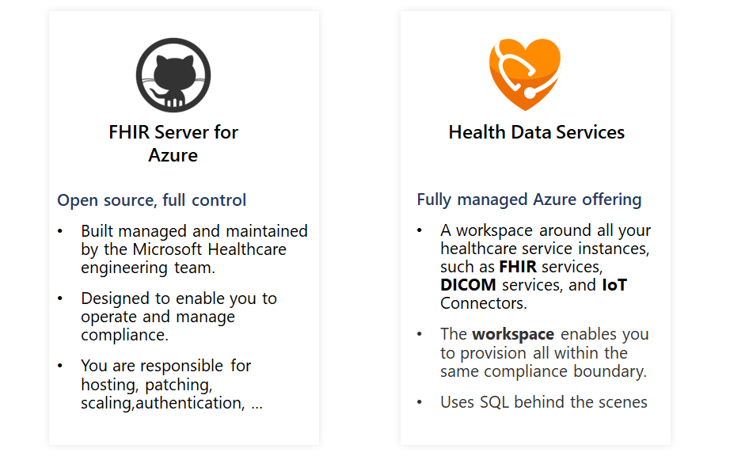

# FHIR-Works-2024
This is the repository for the UCL FHIR Hackathon 2024 submission. 

Group members:

    1. Aiden Li
    2. Felicia Ong
    3. Joshua Soh
    4. Simran Goel

This repository consists of the following:

    1. Report brief on our project idea
    2. Video link of our pitch (2 min)
    3. Basic code 

THIS IS THE LINK TO THE VIDEO:

https://youtu.be/Ef6gml_H9gA

FHIR API
The information being visualized in Aura Mind is being served from an FHIR API.

You can use the Open Source Microsoft FHIR Server: https://github.com/microsoft/fhir-server or use the managed Health Data Services on Azure: https://docs.microsoft.com/en-us/azure/healthcare-apis/healthcare-apis-overview

# Aura Mind: Mental Health Support through the NHS App

## Introduction
Aura Mind integrates with the NHS app to leverage FHIR data and Gemini AI, providing immediate, personalised mental health support. This README outlines the project's components, detailing each file's purpose and integration within the broader system.

## FHIR Server Setup and Data Integration

### Docker Compose (`docker-compose.yml`)
**Purpose**: Automates the setup of a local FHIR server and its database, essential for development and testing with healthcare data.

**Contents**: Defines services for the FHIR server (`hapiproject/hapi:v5.3.0`) and its PostgreSQL database, including environment variables for configuration and volume mappings for data persistence.

**Integration**: Running `docker-compose up -d` deploys the FHIR server environment, accessible for testing and development purposes.

### Mock FHIR Data (`Observation.json`, `Patient.json`, `Procedure.json`)
**Purpose**: Provides sample data representing patient observations, details, and procedures to populate the FHIR server, mimicking real-world healthcare data interactions.

**Contents**:
- **Observation.json**:
  - Resource type: Observation
  - Measurements and simple assertions made about the patient
  - Points to a Patient type by its id

- **Patient.json**:
  - Resource type: Patient
  - Stores personal information of the patient

- **Procedure.json**:
  - Resource type: Procedure
  - An action that is or was performed on or for the patient
  - Points to a Patient type by its id

**Integration**: Manually import these files into the FHIR server to facilitate development and testing, enabling realistic interactions with simulated patient data.

## Chat Bot Implementation (`Chat Bot.py`)

**Purpose**: Demonstrates the integration of an AI-driven chatbot using Google's Vertex AI, showcasing how such technology can support mental health inquiries and provide relevant responses.

**Contents**: A Python script that initiates a chat session with Vertex AI's chat model, handling user inputs and generating AI responses tailored to mental health support scenarios.

**Integration**:
1. **Create a Google Cloud Account**: Sign up at Google Cloud. Enter your payment details to activate your account. You will automatically receive $300 in free credits, and there's no auto-billing, so you won't be charged until you manually upgrade.
2. **Start with Vertex AI**: Go to the Vertex AI quickstart guide to familiarise yourself with the service and begin the setup process.
3. **Follow the Vertex AI SDK for Python Guide**: The section dedicated to the Vertex AI SDK for Python is within the quickstart guide. This will include instructions for installing necessary libraries and setting up your environment.
4. **Setup Project ID**: Use the Cloud Shell Editor to create a new file in the Google Cloud Console. This process will generate a unique Project ID. Note this ID as it will be crucial for the next steps.
5. **Configure the Chat Bot Script**: Update `Chat Bot.py` with your Project ID, keeping the "us-central1" location. For example: `chat_stream_example("YOUR_PROJECT_ID", "us-central1")`.
6. **All Set**: Run AuraMind!
